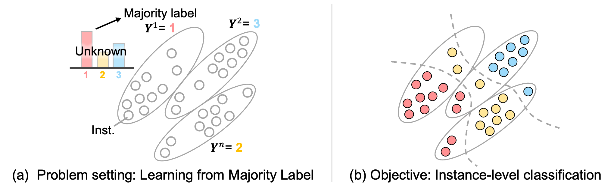

# Learning-from-Majority-Label-A-Novel-Problem-in-Multi-class-Multiple-Instance-Learning
"Learning from Majority Label: A Novel Problem in Multi-class Multiple-Instance Learning" has been accepted for publication in the journal Pattern Recognition!



Shikui Kaito, Shinnosuke Matsuo, Daiki Suehiro, Ryoma Bise
> The paper proposes a novel multi-class Multiple-Instance Learning (MIL) problem called Learning from Majority Label (LML). 
In LML, the majority class of instances in a bag is assigned as the bag-level label. The goal of LML is to train a classification model that estimates the class of each instance using the majority label. This problem is valuable in a variety of applications, including pathology image segmentation, political voting prediction, customer sentiment analysis, and environmental monitoring. To solve LML, we propose a Counting Network trained to produce bag-level majority labels, estimated by counting the number of instances in each class. Furthermore, analysis experiments on the characteristics of LML revealed that bags with a high proportion of the majority class facilitate learning. Based on this result, we developed a Majority Proportion Enhancement Module (MPEM) that increases the proportion of the majority class by removing minority class instances within the bags. Experiments demonstrate the superiority of the proposed method on four datasets compared to conventional MIL methods. Moreover, ablation studies confirmed the effectiveness of each module.

# Requirement
To set up their environment, please run:  
(we recommend to use [Anaconda](https://www.anaconda.com/) for installation.)
```
conda env create -n LML -f LML.yml
conda activate LML
```

# Preparation of the dataset
You can create dataset by running following code. Dataset will be saved in ./data directory.
```
python ./script_supplementary/toy_exp_script/makebag_script/crossvali_make_dataset_10class_uniform.py
```

# Make dataset
You can create datasets by running the following code. 
```
python ./make_bag/make_bags_LIMUC.py
python ./make_bag/crossvalidation_LIMUC.py
python ./make_bag/LIMUC_bag_time_ordering.py
```

# Step1: Training the Counting Network. 
Training the Counting Network. The trained model is used as a pre-trained model in MPEM in the next step.
```
python ./script_supplementary/main.py --non_pos_mask_rate 0.1 --module "Count" --temper1 0.1 --temper2 0.1 --dataset "cifar10" --classes 10 --is_evaluation 0
```

# Step2: Majority Proportion Enhancement Module.
Training the model using bags in which the majority proportion has been enhanced by MPEM, with the removal ratio 'r' ranging from 0.1 to 1.0.
```
python ./script_supplementary/main.py --non_pos_mask_rate 0.1 --module "MPEM" --dataset "cifar10" --classes 10 --is_evaluation 0
python ./script_supplementary/main.py --non_pos_mask_rate 0.2 --module "MPEM" --dataset "cifar10" --classes 10 --is_evaluation 0
python ./script_supplementary/main.py --non_pos_mask_rate 0.3 --module "MPEM" --dataset "cifar10" --classes 10 --is_evaluation 0
python ./script_supplementary/main.py --non_pos_mask_rate 0.4 --module "MPEM" --dataset "cifar10" --classes 10 --is_evaluation 0
python ./script_supplementary/main.py --non_pos_mask_rate 0.5 --module "MPEM" --dataset "cifar10" --classes 10 --is_evaluation 0
python ./script_supplementary/main.py --non_pos_mask_rate 0.6 --module "MPEM" --dataset "cifar10" --classes 10 --is_evaluation 0
python ./script_supplementary/main.py --non_pos_mask_rate 0.7 --module "MPEM" --dataset "cifar10" --classes 10 --is_evaluation 0
python ./script_supplementary/main.py --non_pos_mask_rate 0.8 --module "MPEM" --dataset "cifar10" --classes 10 --is_evaluation 0
python ./script_supplementary/main.py --non_pos_mask_rate 0.9 --module "MPEM" --dataset "cifar10" --classes 10 --is_evaluation 0
python ./script_supplementary/main.py --non_pos_mask_rate 1.0 --module "MPEM" --dataset "cifar10" --classes 10 --is_evaluation 0
```

# Step3: Selecting the optimal removal ratio $r$.
Selecting the optimal removal ratio based on the validation loss, and performing inference on the test data using the model trained with the selected ratio.
```
python ./script_supplementary/select_optimal_k_main.py --module "MPEM" --dataset "cifar10" --classes 10 
```

# Citation
If you find this repository helpful, please consider citing:
(I am currently displaying the arXiv BibTeX entry, but I will replace it with the official citation from the Pattern Recognition journal once it becomes available.)
```
@article{kaito2025learning,
  title={Learning from Majority Label: A Novel Problem in Multi-class Multiple-Instance Learning},
  author={Kaito, Shiku and Matsuo, Shinnosuke and Suehiro, Daiki and Bise, Ryoma},
  journal={arXiv preprint arXiv:2509.04023},
  year={2025}
}
```

# Author
@ Shiku Kaito  
・ Contact: kaito.shiku@human.ait.kyushu-u.ac.jp
